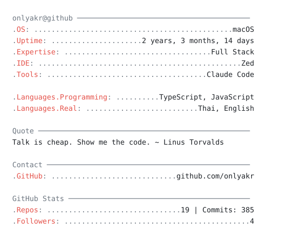

<table>
<tr>
<td valign="middle">

<pre>
⠀⠀⠀⠀⠀⠀⠉⢿⣿⣶⣄⠀⠀⠀⠀⠀⠀⠀⠀⠀⠀⠀⠀⠀⠀⠀⠀⠀⠀⠀⠀⠀⠀⠀⠀⠀⠀⠀⠀⠀
⠀⠀⠀⠀⠀⠀⠀⢸⣿⣿⣿⡀⠀⠀⠀⠀⢨⣷⣲⣄⠀⠀⠀⠀⠀⠀⠀⠀⡀⢠⣄⡀⠀⠀⠀⠀⠀⠀⠀⠀
⠀⠀⠀⠀⠀⠀⠀⠈⢿⣿⣿⣿⣦⠀⠀⠀⣼⣿⣿⣿⣤⡄⠀⣤⣀⡀⠀⢀⣱⣿⣿⠄⠀⠀⠀⠀⠀⠀⠀⠀
⠀⠀⠀⠀⠀⠀⠀⠛⢻⣿⣿⣿⣿⣷⣄⡀⣿⣿⣿⣿⣿⣷⣿⣶⣿⣿⣷⣿⣿⣿⣿⠄⠀⠀⠀⠀⠀⠀⠀⠀
⠀⠀⠀⠀⠀⠀⠀⠀⠀⢺⣿⣿⣿⣿⣿⣶⣿⣿⣿⣿⣿⢋⣴⢌⢻⣿⢋⣴⣌⢻⣿⣧⡀⠀⠀⠀⠀⠀⠀⠀
⠀⠀⠀⠀⠀⠀⠀⠀⠀⠀⢻⣿⣿⣿⣿⣇⣿⣿⣿⣿⣿⣦⣐⣠⣾⣿⣦⣙⣠⣾⣿⣿⠆⠀⠀⠀⠀⠀⠀⠀
⠀⠀⠀⠀⠀⠀⠀⠀⠀⠐⣺⣿⣿⣿⣿⣿⣿⣿⣿⣿⣿⣿⣿⣿⣿⣿⣿⣿⣿⣿⣿⡟⠀⠀⠀⠀⠀⠀⠀⠀
⠀⠀⠀⠠⠄⠀⠀⣴⣾⣿⣿⣿⣿⣿⣿⣿⣿⣿⣿⣿⣿⣿⣿⣿⣿⣿⣿⣿⣿⣿⠁⠀⠀⠀⠀⠀⠀⠀⠀⠀
⠀⠀⠀⠀⠰⣶⣿⣿⣿⣿⣿⣿⣿⣿⣿⣿⣿⣿⣿⣿⣿⣿⣿⣿⣿⣿⣿⣿⣿⣿⣦⡀⠀⠀⠀⠀⠀⠀⠀⠀
⠀⠀⠀⠠⢄⣿⣿⣿⣿⣿⣿⣿⣿⣿⣿⣿⣿⣿⣿⣿⣿⣿⣿⣿⣿⣿⣿⣿⣿⣿⣿⣿⣤⡀⠀⠀⠀⠀⠀⠀
⠀⠀⢀⣸⣿⣿⣿⣿⣿⣿⡿⠻⣿⣿⣿⣿⣿⣿⣿⣿⣿⣿⣿⣿⣿⣿⢻⣿⣿⣿⣿⣿⣿⣷⣀⠀⠀⠀⠀⠀
⠀⠀⣿⣿⣿⣿⣿⡿⠏⠁⠀⠀⢻⣿⣿⣿⣿⣿⣿⡟⠛⠛⠛⠉⠁⠀⠀⠉⠻⣿⣿⣿⣿⣿⣿⣶⡀⠀⠀⠀
⠰⣷⣿⣿⣿⣿⡏⠀⠀⠀⠀⠀⠘⢿⣿⣿⣿⣿⣿⣿⠀⠀⠀⠀⠀⠀⠀⠀⠀⠈⠙⢿⣿⣿⣿⣿⣿⣶⣦⣦
⠱⣿⣿⣿⣿⣿⠇⠀⠀⠀⠀⠀⣴⣾⣿⣿⣿⣿⣿⣿⣶⡆⠀⠀⠀⠀⠀⠀⠀⠀⠀⠀⠙⢻⣿⣿⣿⣿⣿⣿
⠀⠶⠈⠉⠁⠀⠀⠀⠀⠀⠀⠀⠙⠻⠿⠟⠿⠛⠉⠉⠁⠀⠀⠀⠀⠀⠀⠀⠀⠀⠀⠀⠀⠘⠛⠉⠉⠛⠛⠉
</pre>

</td>
<td>
<picture>
  <source media="(prefers-color-scheme: dark)" srcset="card-dark.svg">
  
</picture>
</td>
</tr>
</table>
